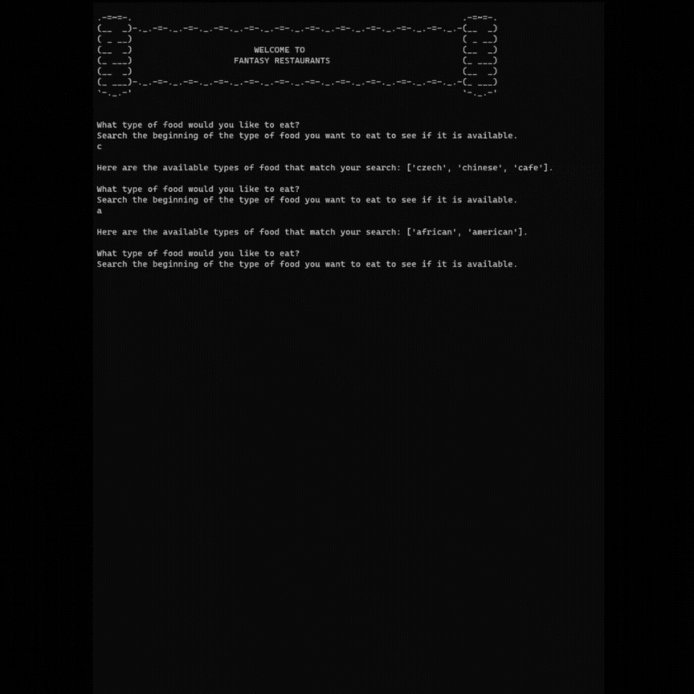

# **Reccomendation Software Project**

Just a simple project while learning data structures and algorithms in python.
It takes in user input to create a list of made up restaurants based on food-type and allows them to choose a sorted method before returning the list of restaurants.
I explained my choices in the comments of the code.

    
